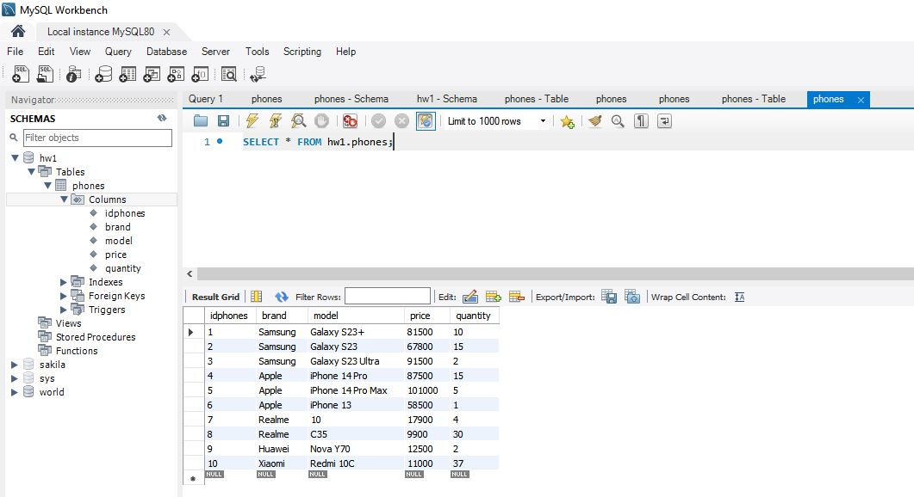
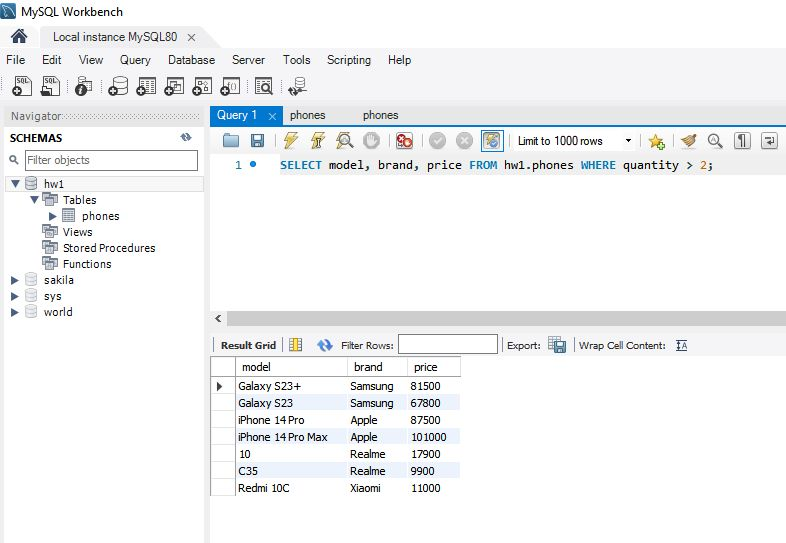
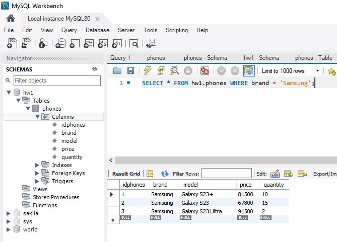

# ДЗ1
1. Создайте таблицу с мобильными телефонами, используя графический интерфейс. Заполните БД данными.
2. Выведите название, производителя и цену для товаров, количество которых превышает 2.
3. Выведите весь ассортимент товаров марки “Samsung”.

## Задание 1
Создайте таблицу с мобильными телефонами, используя графический интерфейс. Заполните БД данными.

**SELECT * FROM hw1.phones;**

## Задание 2
Выведите название, производителя и цену для товаров, количество которых превышает 2.

**SELECT model, brand, price FROM hw1.phones WHERE quantity > 2;**

## Задание 3
Выведите весь ассортимент товаров марки “Samsung”.

**SELECT * FROM hw1.phones WHERE brand = 'Samsung';**

